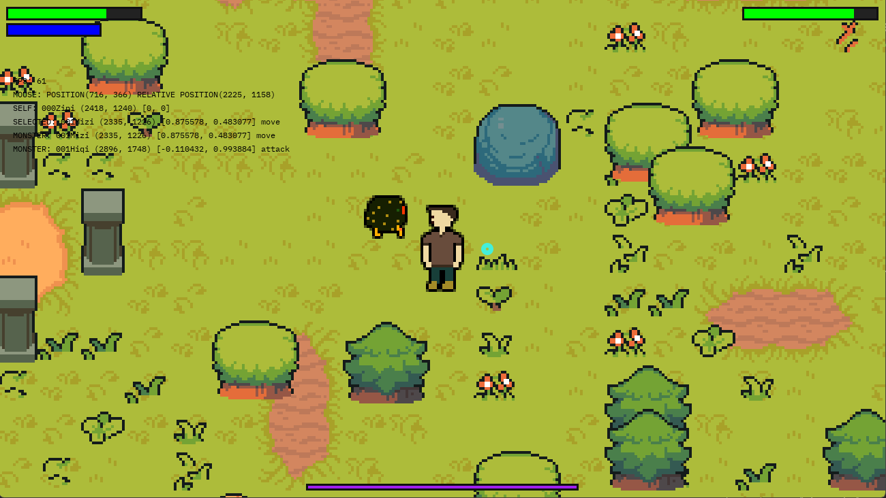
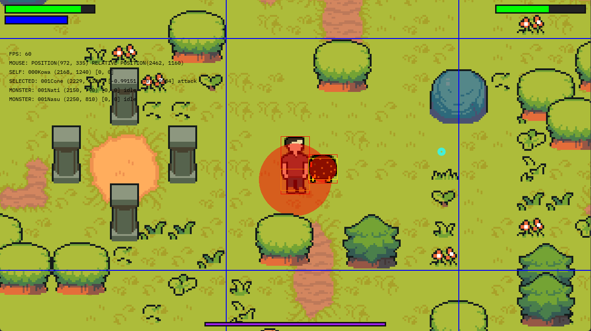

# jogo-online

## Usage

### Run
```bash
python main.py
```

### Start server
```bash
python main.py -s
```

### Flags
``-s`` Start server  
``-l`` Activate loggin (for server communication)

## Screenshots




